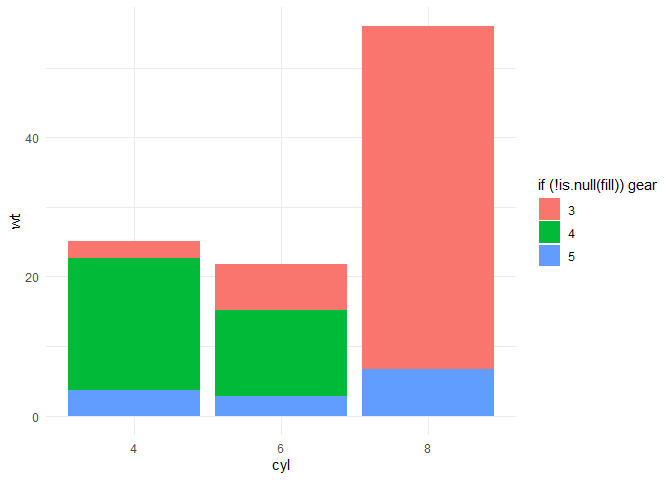
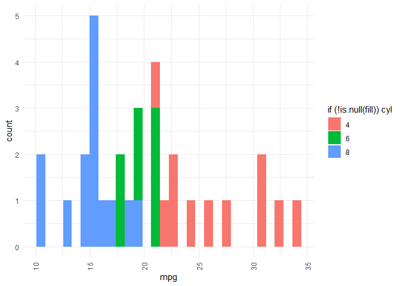
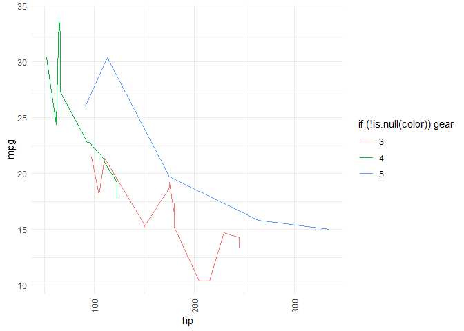

<!-- README.md is generated from README.Rmd. Please edit that file -->

# plottie

<!-- badges: start -->
<!-- badges: end -->

The `plottie` package provides a simple set of functions for quickly
creating basic ggplot2 visualizations without writing full ggplot code
manually.

## Installation

You can install the development version of plottie from
[GitHub](https://github.com/) with:

``` r
# install.packages("devtools")
devtools::install_github("aylahauser/plottie")
```

## Usage

Given two numeric variables, the `easy_scatterplot()` function creates a
scatterplot in the plot window using ggplot2. Users can customize point
color and pass additional ggplot2 arguments such as size, alpha, etc.

``` r
library(plottie)

mtcars$cyl <- as.factor(mtcars$cyl)
mtcars$gear <- as.factor(mtcars$gear)

easy_scatterplot(mtcars, x = "wt", y = "mpg", color = "cyl")
```


Given a categorical variable, the `easy_barplot()` function creates a
barplot in the plot window using ggplot2. Users can customize the fill
color and pass additional arguments like width, alpha, etc.

``` r
easy_barplot(mtcars, x = "cyl", y = "wt", stat = "identity", fill = "gear")
```



Given a numeric variable, the `easy_histogram()` function creates a
histogram in the plot window using ggplot2. Users can customize fill
color and provide extra arguments such as bins, alpha, etc.

``` r
easy_histogram(mtcars, x = "mpg", fill = "cyl")
#> `stat_bin()` using `bins = 30`. Pick better value with `binwidth`.
```



Given one categorical and one numeric variable, the `easy_boxplot()`
function creates a boxplot in the plot window using ggplot2. Users can
customize a color and add extra ggplot2 arguments like width, alpha,
etc.

``` r
easy_boxplot(mtcars, x = "cyl", y = "mpg", color = "gear")
```


Given two numeric variables, the `easy_lineplot()` function creates a
line plot in the plot window using ggplot2. Users can customize the line
color and pass additional arguments such as size, linetype, etc.

``` r
easy_lineplot(mtcars, x = "hp", y = "mpg", color = "gear")
```



Given one or two variable names, the `plot_helper()` function suggests
an appropriate plot type based on variable types. It returns a short
message indicating the plot type that is recommended.

``` r
library(ggplot2)

plot_helper(mpg, x = "cty", y = "hwy")
#> [1] "Since both the independent and dependent variables are continuous, the best plots to create would either be a scatterplot or a line plot. See help pages for easy_scatterplot() and easy_lineplot() for more information."
```
